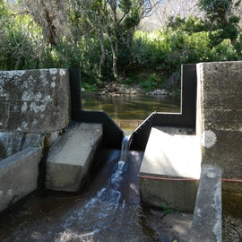
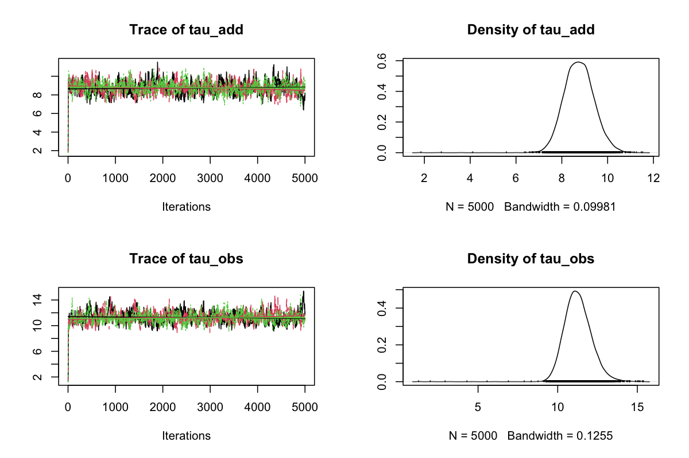
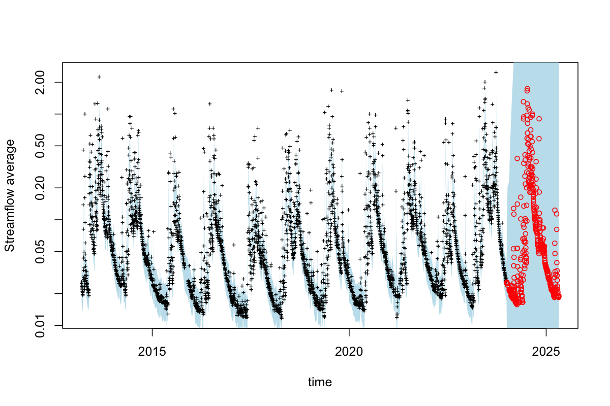
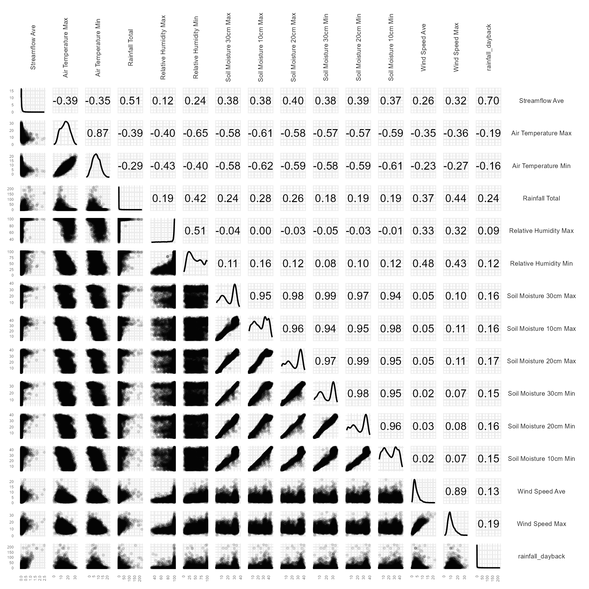
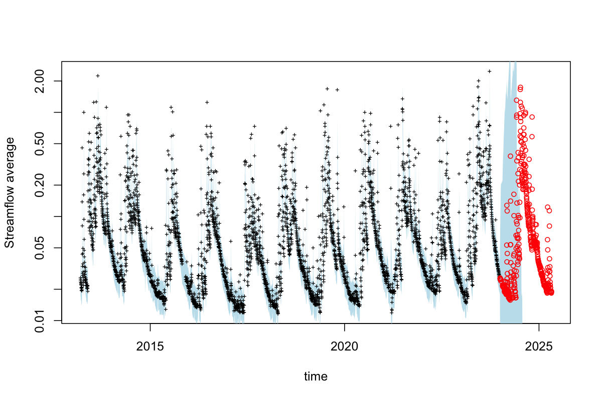
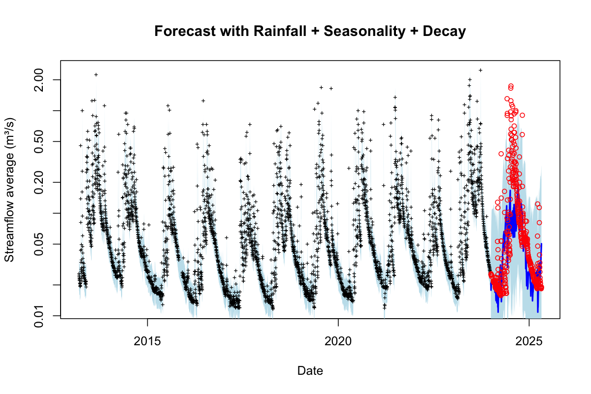
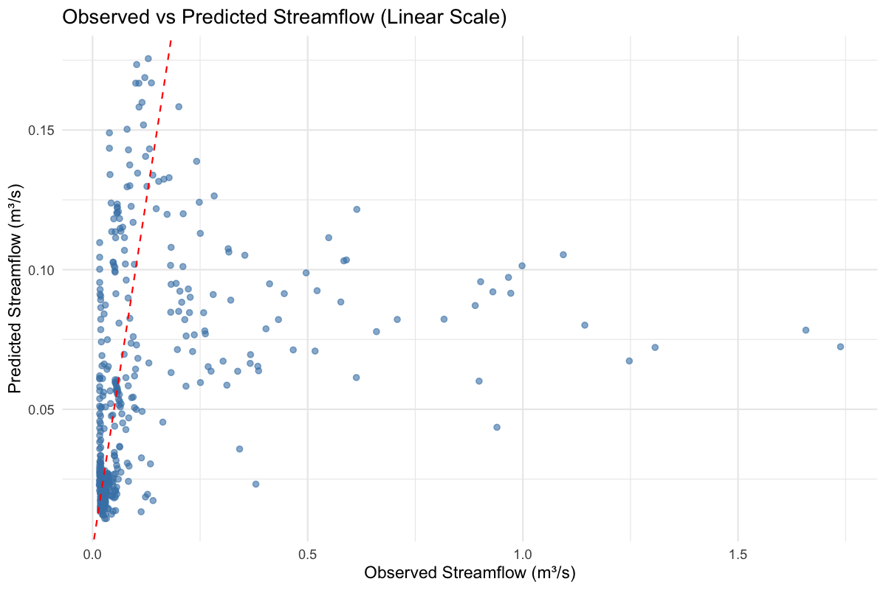
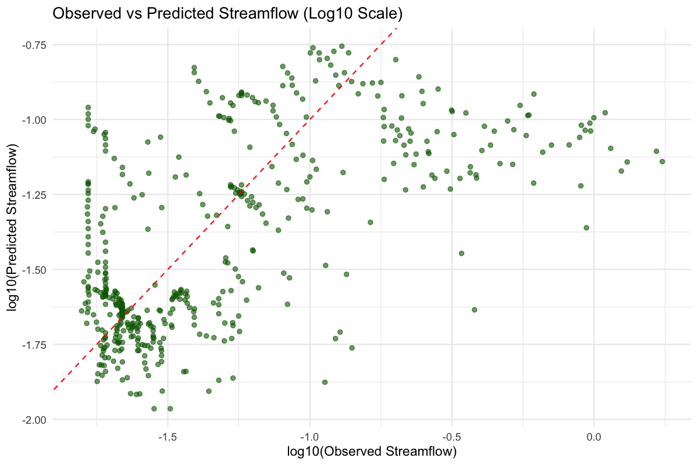
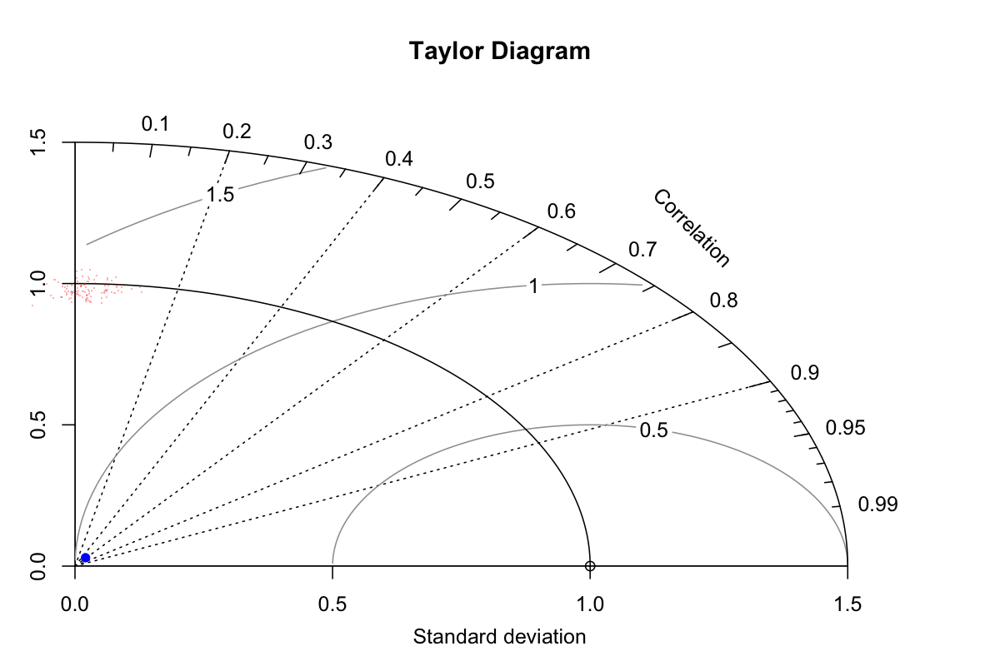

<!-- README.md is generated from README.Rmd. Please edit that file -->

```{r, include = FALSE}
knitr::opts_chunk$set(
  collapse = TRUE,
  comment = "#>"
)
```

# Jonkershoek streamflow forecasting

## Team members

Jess Howard, Jess Prevôst, Nicola Bredenkamp, Vernon Visser.

```{r libraries}
library(tidyverse)
library(rjags)
library(plotrix)
library(knitr)
```

## Introduction

```{r, echo=FALSE, fig.align='center'}
# Read daily data
ddat <- read_csv("data/data_daily_cleaned.csv")

# Plot daily streamflow data with horizontal line showing flood threshold
ddat |> ggplot() +
  geom_line(aes(y = `Streamflow Ave`, x = as.Date(Date))) +
  geom_line(data = ddat %>% filter(as.Date(Date) > as.Date("2024-01-01")),
            aes(y = `Streamflow Ave`, x = Date), colour = "orange") +
  geom_vline(aes(xintercept = as.Date("2024-01-01")), colour = "orange") +
  geom_vline(aes(xintercept = as.Date("2013-03-16")), colour = "orange") +
  ggtitle("Langrivier daily streamflow") +
  xlab("Date") +
  ylab("Streamflow (Cubic metres per second)") +
  theme_minimal()
```

Our project assessed daily streamflow in the Jonkershoek catchment in relation to daily rainfall.

```{r, echo=FALSE, out.width='80%', fig.align='center'}


```

Jonkershoek is an old forestry site where many catchments are compromised by alien pine trees. Our catchment is outside of the plantations and represents a control site.

```{r, echo=FALSE, out.width='80%', fig.align='center'}

```

This is the weir at which streamflow was measured.

## Step 1: Data Cleaning

Data cleaning and exploratory visualization was performed on the daily streamflow data. Invalid or unrealistic values were converted to NA (negative temperatures below -50°C, humidity values that were zero or exceed realistic bounds, soil moisture readings that were too low or predate 2015, and streamflow values below 0.01). The data was reshaped into long format to visualize the temporal patterns and assess data quality. The cleaned daily streamflow datasets were saved as new .csv files for use in other code scripts.

## Step 2: Null State-space Model using JAGS

Withhold the data from the start of 2024 by making the streamflow data NA for the forecasting and validation steps.The calibration data was saved as a .csv file called "cal_ddat". The dates before 2013-03-16 where there is no rainfall data were removed. A one day set back lag was assumed between the rain falling and the streamflow increase.

```{r, eval = FALSE, echo = T, warning = FALSE}

# Withhold data
cal_ddat <- ddat |> mutate(`Streamflow Ave` = ifelse(Date < "2024-01-01", `Streamflow Ave`, NA)) %>%
  filter(Date > "2013-03-16") # remove dates before 2013-03-16 where no rainfall data
# Remove dates before 2013-03-16 where there is no rainfall data
ddat <- ddat %>%
  filter(Date > "2013-03-16") 

# Need to move previous day's rainfall to current day 
cal_ddat <- cal_ddat %>%
  mutate(rainfall_dayback = lag(`Rainfall Total`, 1))

```

Data for the model was assigned.

```{r, eval = FALSE, echo = T, warning = FALSE}

# Format data for model
time <- cal_ddat$Date
y <- cal_ddat$`Streamflow Ave`
z <- ddat$`Streamflow Ave` # for plotting later
y_log <- log(y)
y_log[is.infinite(y_log)] <- NA

```

The null time-series model was determined and defined, then the model was called through JAGS and run.

```{r, eval = FALSE, echo = T, warning = FALSE}

# Define the model
RandomWalk <- "
model{
  
  #### Data Model
  for(t in 1:n){
    y[t] ~ dnorm(x[t],tau_obs)
  }
  
  #### Process Model (random walk)
  for(t in 2:n){
    x[t] ~ dnorm(x[t-1], tau_add)
  }

  #### Priors
  x[1] ~ dnorm(x_ic, tau_ic)
  tau_obs ~ dgamma(a_obs,r_obs) ## prior on observation error
  tau_add ~ dgamma(a_add,r_add) ## prior on process error
}
"

data <- list(y=y_log,n=length(y),      ## data
             x_ic=log(0.1),tau_ic=0.1,    ## initial condition prior
             a_obs=1,r_obs=1,           ## obs error prior
             a_add=1,r_add=1            ## process error prior
)

nchain = 3
# init <- list()
# for(i in 1:nchain){
#   y.samp = sample(y,length(y),replace=TRUE)
#   init[[i]] <- list(tau_add=1/var(diff(log(y.samp))),  ## initial guess on process precision
#                     tau_obs=5/var(log(y.samp)))        ## initial guess on obs precision

# Run the model
j.model   <- jags.model (file = textConnection(RandomWalk),
                         data = data,
                         # inits = init,
                         n.chains = 3)

```

The convergence was the checked.

```{r, eval = FALSE, echo = T, warning = FALSE}

# Sample from model without x to check that convergence has happened
jags.out   <- coda.samples (model = j.model,
                            variable.names = c("tau_add","tau_obs"),
                            n.iter = 5000)

# See if convergence has happened
png("img/jags_traceplot_random_walk.png", width = 1200, height = 800, res = 150)
plot(jags.out) # traceplot and density check
dev.off() 

```

```{r, echo=FALSE, fig.align='center'}

```

The random-walk model was checked, and the data and confidence intervals were visualized.

```{r, eval = FALSE, echo = T, warning = FALSE}

#Sample the model
jags.out   <- coda.samples (model = j.model,
                            variable.names = c("x","tau_add","tau_obs"),
                            n.iter = 10000)

burnin = 1000                                   ## determine convergence
jags.burn <- window(jags.out, start = burnin)  ## remove burn-in

# Plot data and confidence interval
time.rng = c(1,length(time))       ## adjust to zoom in and out
out <- as.matrix(jags.out)         ## convert from coda to matrix  
x.cols <- grep("^x",colnames(out)) ## grab all columns that start with the letter x
ci <- apply(exp(out[,x.cols]),2,quantile,c(0.025,0.5,0.975)) ## model was fit on log scale

png("img/forecast_random_walk.png", width = 1200, height = 800, res = 150)

plot(time,ci[2,],type='n',ylim=range(y,na.rm=TRUE),ylab="Streamflow average", log='y', xlim=time[time.rng])
## adjust x-axis label to be monthly if zoomed
if(diff(time.rng) < 100){ 
  axis.Date(1, at=seq(time[time.rng[1]],time[time.rng[2]],by='month'), format = "%Y-%m")
}
ecoforecastR::ciEnvelope(time,ci[1,],ci[3,],col=ecoforecastR::col.alpha("lightBlue",0.75)) # add confidence interval 
# add data points
included <- !is.na(y)
heldout <- is.na(y)
# Plot included data points (model saw these)
points(time[included], y[included], pch="+", col='black', cex=0.6)  # filled black dots
# Plot held-out data points (model did NOT see these)
points(time[heldout], z[heldout], pch=1, col='red', cex=0.8)       # open red circles 

dev.off() 
```

```{r, echo=FALSE, fig.align='center'}

```

## Step 3: Identifying the Co-variate

```{r, eval = F, echo=FALSE}
# Create new variable - Rainfall Total "set back" one day - assumes there will be a one day
# lag between rain falling and streamflow increase
ddat$rainfall_dayback = ddat$`Rainfall Total`[c(2:length(ddat$`Rainfall Total`),NA)]

library(GGally)

# Custom correlation panel without "Corr" text
my_cor <- function(data, mapping, ...) {
  ggally_cor(data, mapping, 
             ...) +
    theme_void() + 
    theme(panel.background = element_rect(fill = "white", colour = NA)) +
    scale_x_continuous(expand = expansion(mult = c(0.2, 0.2))) +
    scale_y_continuous(expand = expansion(mult = c(0.2, 0.2)))
}

# Remove "Corr" label by customizing label parsing inside ggally_cor
my_cor_nolabel <- function(data, mapping, ...) {
  cor_val <- cor(eval_data_col(data, mapping$x), eval_data_col(data, mapping$y), use = "complete.obs")
  label <- formatC(cor_val, format = "f", digits = 2)
  ggplot(data = data, mapping = mapping) +
    annotate("text", x = 0.5, y = 0.5, label = label, size = 3) +
    theme_void()
}

ggcorr = ggpairs(ddat %>% select(-Date),
        upper = list(continuous = my_cor_nolabel, size = 2),
        lower = list(
          continuous = wrap("points", 
                            alpha = 0.1, size = 0.5)),
        diag = list(continuous = "densityDiag")) +
  theme_minimal()  +
  theme(
  axis.text.x = element_text(angle = 90, vjust = 0.5, hjust = 1, size = 3),
  axis.text.y = element_text(angle = 0, vjust = 0.5, hjust = 1, size = 3),
  strip.text.x = element_text(angle = 90, size = 5),  # top labels (columns)
  strip.text.y = element_text(angle = 0, size = 5 )   # side labels (rows)
) 


ggsave(ggcorr, filename = "img/correlations_scatterplot.png", device = "png", width = 16, height = 16, units = "cm")
```

```{r, echo=FALSE, fig.align='center'}

```

## Step 4: Adding the Co-variates to the Model

```{r, eval = FALSE, echo = T, warning = FALSE}

# Call the daily rainfall data used
rainfall_lag <- cal_ddat$rainfall_dayback 
rainfall_lag[is.na(rainfall_lag)] <- 0 # for now make NA values 0


# Define the model
Rainfall_RandomWalk <- "
model{
  
  #### Data Model
  for(t in 1:n){
    y[t] ~ dnorm(x[t],tau_obs)
  }
  
  #### Process Model (random walk)
  for(t in 2:n){
    x[t] ~ dnorm(x[t-1] + beta * c[t], tau_add)
  }

  #### Priors
  x[1] ~ dnorm(x_ic, tau_ic)
  beta ~ dnorm(0, 0.01) ## prior on the beta for rainfall
  tau_obs ~ dgamma(a_obs,r_obs) ## prior on observation error
  tau_add ~ dgamma(a_add,r_add) ## prior on process error
}
"

data <- list(y=y_log,n=length(y),      ## data
             c = rainfall_lag,  ## rainfall
             x_ic=log(0.1),tau_ic=0.1,    ## initial condition prior
             a_obs=1,r_obs=1,           ## obs error prior
             a_add=1,r_add=1            ## process error prior
)


# Run the model
j.model   <- jags.model (file = textConnection(Rainfall_RandomWalk),
                         data = data,
                         # inits = init,
                         n.chains = 3)

jags.out   <- coda.samples (model = j.model,
                            variable.names = c("x","tau_add","tau_obs"),
                            n.iter = 10000)

burnin = 1000                                   ## determine convergence
jags.burn <- window(jags.out, start = burnin)  ## remove burn-in

```

The rainfall data and confidence interval was visualized.

```{r, eval = FALSE, echo = T, warning = FALSE}

# Plot data and confidence interval
time.rng = c(1,length(time))       ## adjust to zoom in and out
out <- as.matrix(jags.out)         ## convert from coda to matrix  
x.cols <- grep("^x",colnames(out)) ## grab all columns that start with the letter x
ci <- apply(exp(out[,x.cols]),2,quantile,c(0.025,0.5,0.975)) ## model was fit on log scale

png("img/forecast_Rainfall.png", width = 1200, height = 800, res = 150)

plot(time,ci[2,],type='n',ylim=range(y,na.rm=TRUE),ylab="Streamflow average", log='y', xlim=time[time.rng])
## adjust x-axis label to be monthly if zoomed
if(diff(time.rng) < 100){ 
  axis.Date(1, at=seq(time[time.rng[1]],time[time.rng[2]],by='month'), format = "%Y-%m")
}
ecoforecastR::ciEnvelope(time,ci[1,],ci[3,],col=ecoforecastR::col.alpha("lightBlue",0.75)) # add confidence interval 
# add data points
included <- !is.na(y)
heldout <- is.na(y)
# Plot included data points (model saw these)
points(time[included], y[included], pch="+", col='black', cex=0.6)  # filled black dots
# Plot held-out data points (model did NOT see these)
points(time[heldout], z[heldout], pch=1, col='red', cex=0.8)       # open red circles 

dev.off() 
```

```{r, echo=FALSE, fig.align='center'}

```

## Step 5: Forecast the Streamflow Daily Data

The missing rainfall data was modeled and a seasonality component added to the model.

```{r, eval = FALSE, echo = T, warning = FALSE}

#Add a seasonality component
doy <- as.numeric(format(time, "%j")) / 365  # day of year scaled 0–1
season_sin <- sin(2 * pi * doy)
season_cos <- cos(2 * pi * doy)

#Identify missing values in rainfall
rain <- cal_ddat$rainfall_dayback

# Track missing rainfall values
is_na_rain <- is.na(rain)
n_missing <- sum(is_na_rain)
missing_idx <- which(is_na_rain)

```

The model was defined and run through JAGS.

```{r, eval = FALSE, echo = T, warning = FALSE}

RandomWalk_rain_decay <- "
model {

  # Observation model
  for(t in 1:n){
    y[t] ~ dnorm(x[t], tau_obs)
  }

  # Process model with autoregressive decay and covariates
  for(t in 2:n){
    mu[t] <- mu0 + beta_decay * (x[t-1] - mu0) + 
             beta_rain * rain[t] + 
             beta_season_sin * season_sin[t] + 
             beta_season_cos * season_cos[t]
    
    x[t] ~ dnorm(mu[t], tau_add)
  }

  # Impute missing rain values
  for(i in 1:n_missing){
    rain[missing_idx[i]] ~ dnorm(mu_rain, tau_rain)
  }

  # Priors
  mu0 ~ dnorm(0, 0.001)                     # Mean log-streamflow level
  x[1] ~ dnorm(mu0, tau_ic)                 # Initial latent state
  
  tau_obs ~ dgamma(a_obs, r_obs)            # Observation error
  tau_add ~ dgamma(a_add, r_add)            # Process error

  beta_decay ~ dunif(0, 1)                  # AR(1) coefficient bounded for stability
  beta_rain ~ dnorm(0, 0.01)
  beta_season_sin ~ dnorm(0, 0.01)
  beta_season_cos ~ dnorm(0, 0.01)

  mu_rain ~ dnorm(0, 0.01)                  # Mean log-rainfall for imputation
  tau_rain ~ dgamma(1, 1)                   # Rainfall imputation variance
}
"

data <- list(
  y = y_log,
  rain = log(rain+1),               # vector with NAs
  missing_idx = missing_idx,     # indices to impute
  n_missing = n_missing,         # how many to impute
  n = length(y),
  #  x_ic = log(0.1),
  tau_ic = 0.1,
  a_obs = 1,
  r_obs = 1,
  a_add = 1,
  r_add = 1, 
  season_sin = season_sin,      
  season_cos = season_cos )

# Run the model
j.model <- jags.model(file = textConnection(RandomWalk_rain_decay),
                      data = data,
                      n.chains = 3)

```

The convergence was checked.

```{r, eval = FALSE, echo = T, warning = FALSE}

# Full posterior sampling
jags.out <- coda.samples(model = j.model,
                         variable.names = c("x", "tau_add", "tau_obs", "beta_rain", "beta_decay", "mu_rain", "tau_rain", "rain"),,
                         n.iter = 5000)


# Remove burn-in
burnin <- 1000
jags.burn <- window(jags.out, start = burnin)

```

The ouput of the model was visualized.

```{r, eval = FALSE, echo = T, warning = FALSE}

# Plot data and confidence interval
time.rng = c(1,length(time))       ## adjust to zoom in and out
out <- as.matrix(jags.out)         ## Convert MCMC output to matrix
x.cols <- grep("^x",colnames(out)) ## grab all columns that start with the letter x
ci <- apply(exp(out[,x.cols]),2,quantile,c(0.025,0.5,0.975)) ## model was fit on log scale

# Let's plot just the last year before predicting
forecast_start <- as.Date("2024-01-01") # Define the start of the forecast period
forecast_end <- max(time, na.rm = TRUE)  # Adjust if you want a specific cutoff
plot_start <- forecast_start - 365

# Logical vector to subset the full time range
plot_range <- time >= plot_start & time <= forecast_end

plot(time[plot_range], ci[2, plot_range], type = 'n',
     ylim = range(y, na.rm = TRUE),
     ylab = "Streamflow average (m³/s)",
     log = 'y',
     xlim = c(plot_start, forecast_end),
     xlab = "Date",
     main = "Forecast with Rainfall + Seasonality + Decay")
# Confidence envelope
ecoforecastR::ciEnvelope(time[plot_range], ci[1, plot_range], ci[3, plot_range],
                         col = ecoforecastR::col.alpha("lightblue", 0.75))

# Mean forecast line (for forecast period only)
forecast_period <- time >= forecast_start
lines(time[forecast_period], ci[2, forecast_period], col = "blue", lwd = 2)

# Observed data points
included <- !is.na(y)
points(time[plot_range & included], y[plot_range & included], pch = "+", col = 'black', cex = 0.6)

# Held-out points
heldout <- is.na(y) & time >= as.Date("2024-01-01")
points(time[plot_range & heldout], z[plot_range & heldout], pch = 1, col = 'red', cex = 0.8)

png("img/forecast_rain_decay.png", width = 1200, height = 800, res = 150)

dev.off()
```

```{r, echo=FALSE, fig.align='center'}

```

## Step 6: Validate Against the Held Out Data

```{r, eval = FALSE, echo = T, warning = FALSE}
##### Data validation
# Posterior predictions of x (latent state)
x_cols <- grep("^x\\[", colnames(out))
x_post <- exp(out[, x_cols])  # back-transform from log-scale
x_med <- apply(x_post, 2, median)
x_mean <- apply(x_post, 2, mean)

# Only for observed data
resids <- y[included] - x_med[included]

# Root Mean Squared Error
rmse <- sqrt(mean(resids^2))

# R-squared (squared correlation between observed and predicted)
r2 <- cor(y[included], x_med[included])^2

validation_metrics <- data.frame(
  Metric = c("RMSE", "R-squared"),
  Value = c(round(rmse, 3), round(r2, 3))
)

knitr::kable(validation_metrics, caption = "Model validation metrics: streamflow with rainfall, seasonality, and decay")
dev.off()
```


```{r, eval = FALSE, echo = T, warning = FALSE}
### Identify held out data
heldout.idx <- which(heldout)

### Extract modelled predictions for held out data
x.heldout.cols <- x.cols[heldout.idx]
ci.heldout <- apply(exp(out[, x.heldout.cols]), 2, quantile, c(0.025, 0.5, 0.975))


#### Compare predictions versus observed
validation_df <- data.frame(
  Date = time[heldout.idx],
  Observed = y_full[heldout.idx],         # Use full streamflow log here
  Predicted_median = ci.heldout[2,],
  Predicted_lower = ci.heldout[1,],
  Predicted_upper = ci.heldout[3,]
)

knitr::kable(head(validation_df, 10), 
             digits = 3, 
             caption = "Comparison of Model Predictions to Held-Out Observations")

```

```{r, eval = FALSE, echo = T, warning = FALSE}
# Remove any rows with missing values (just in case)
valid_data <- na.omit(validation_df)

# Extract observed and predicted vectors
obs <- valid_data$Observed
pred <- valid_data$Predicted_median

# Calculate R-squared
rsq <- cor(obs, pred)^2
rmse <- sqrt(mean((obs - pred)^2))

validation_metrics <- data.frame(
  Metric = c("RMSE", "R-squared"),
  Value = c(round(rmse, 3), round(rsq, 3))
)

knitr::kable(validation_metrics, 
             caption = "Validation Metrics on Held-Out Data")
```


```{r, eval = FALSE, echo = T, warning = FALSE}
## outputs on non-log data

obs_real <- exp(valid_data$Observed)
pred_real <- valid_data$Predicted_median  # Already in real scale

rsq_real <- cor(obs_real, pred_real)^2
rmse_real <- sqrt(mean((obs_real - pred_real)^2))

validation_metrics_real <- data.frame(
  Metric = c("RMSE (real scale)", "R-squared (real scale)"),
  Value = c(round(rmse_real, 3), round(rsq_real, 3))
)

knitr::kable(validation_metrics_real, 
             caption = "Validation on Held-Out Data (Real Scale)")

```

```{r, eval = FALSE, echo = T, warning = FALSE}
###Plotting outputs
# Add a tiny jitter to zero or near-zero values to avoid log(0)
jitter_amount <- 1e-6

valid_data <- validation_df %>%
  mutate(Observed_real = exp(Observed),
         Observed_jittered = ifelse(Observed_real <= 0, 1e-6, Observed_real),
         Predicted_jittered = ifelse(Predicted_median <= 0, 1e-6, Predicted_median),
         Observed_log = log10(Observed_jittered),
         Predicted_log = log10(Predicted_jittered))

valid_data$Predicted_log <- log10(valid_data$Predicted_median + 1e-6)

#linear scale streamflow
ggplot(valid_data, aes(x = Observed_real, y = Predicted_median)) +
  geom_point(alpha = 0.6, color = "steelblue") +
  geom_abline(slope = 1, intercept = 0, linetype = "dashed", color = "red") +
  labs(
    x = "Observed Streamflow (m³/s)",
    y = "Predicted Streamflow (m³/s)",
    title = "Observed vs Predicted Streamflow (Linear Scale)"
  ) +
  theme_minimal()

png("img/valid5", width = 1200, height = 800, res = 150)
```

```{r, echo=FALSE, fig.align='center'}

```

```{r, eval = FALSE, echo = T, warning = FALSE}
#log_scale
ggplot(valid_data, aes(x = Observed_log, y = Predicted_log)) +
  geom_point(alpha = 0.6, color = "darkgreen") +
  geom_abline(slope = 1, intercept = 0, linetype = "dashed", color = "red") +
  labs(
    x = "log10(Observed Streamflow)",
    y = "log10(Predicted Streamflow)",
    title = "Observed vs Predicted Streamflow (Log10 Scale)"
  ) +
  theme_minimal()

png("img/valid6", width = 1200, height = 800, res = 150)
```

```{r, echo=FALSE, fig.align='center'}

```

```{r, eval = FALSE, echo = T, warning = FALSE}
### Add Taylor plot
Observed <- validation_df$Observed
Predicted <- validation_df$Predicted_median
# Step 1: Clean / filter
qaqc <- complete.cases(Observed, Predicted)  # OR: qaqc <- !is.na(Observed) & !is.na(Predicted)

O <- Observed[qaqc]
E <- Predicted[qaqc]

# Step 2: Simulate ensemble matrix if you don't already have one
set.seed(123)
n_draws <- 100
jitter_sd <- sd(E - O, na.rm = TRUE)

stream <- replicate(n_draws, E + rnorm(length(E), 0, jitter_sd))

# Step 3: Taylor diagram
taylor.diagram(ref = O, model = E, normalize = TRUE, ref.sd = TRUE, col = "blue", pch = 16)

# Step 4: Add ensemble members
for(i in 1:ncol(stream)){
  taylor.diagram(ref = O, model = stream[, i],
                 col = rgb(1, 0, 0, 0.3), pch = ".", add = TRUE, normalize = TRUE)
}

png("img/valid7", width = 1200, height = 800, res = 150)
```

```{r, echo=FALSE, fig.align='center'}

```
# Acknowlegdements

```{r, echo=FALSE, out.width='80%', fig.align='center'}

```

We thank SAEON for the data.
