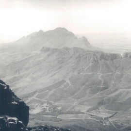

<!-- README.md is generated from README.Rmd. Please edit that file -->

```{r, include = FALSE}
knitr::opts_chunk$set(
  collapse = TRUE,
  comment = "#>"
)
```

# Jonkershoek streamflow forecasting

# Introduction

Our project assessed daily streamflow in the Jonkershoek catchment in relation to daily rainfall.

```{r, echo=FALSE, out.width='80%', fig.align='center'}


```

Jonkershoek is an old forestry site where many catchments are compromised by alien pine trees. Our catchment is outside of the plantations and represents a control site.

<!-- badges: start -->

<!-- badges: end -->

## Team members

Jess Howard Jess Prevôst Nicola Bredenkamp Vernon Visser

```{r libraries}
library(tidyverse)
```

```{r, eval = FALSE, echo = T, warning = FALSE}
#Change the stuff above if you want to:
# eval = F: Doesn't run the code (useful if it's just installing packages or you have saved the outputs already)
# echo = T: Show the outputs in the markdown output
# warning = F: Don't display R warnings
#...

# Read hourly metadata and display
hmdat <- read_csv("data/metadata_hourly_2025-07-09.csv")

hmdat
```

```{r, echo=FALSE, out.width='80%', fig.align='center'}

```

This is the weir at which streamflow was measured.

Acknowlegdements

```{r, echo=FALSE, out.width='80%', fig.align='center'}

knitr::include_graphics("img/saeon_hex.jpg")
```

We thank SAEON for the data

If you knit this (knit button above), it will produce a .md document that GitHub can read
