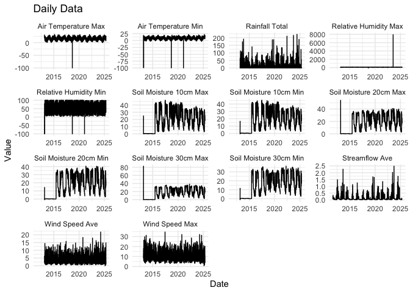
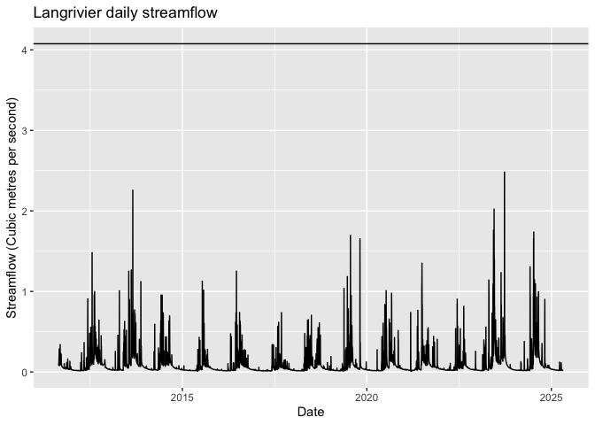

<!-- README.md is generated from README.Rmd. Please edit that file -->

# Jonkershoek streamflow and flood events

<!-- badges: start -->

<!-- badges: end -->

## Project Description

The goal of `streamflow_jonkershoek` is to set up a project focused on
forecasting flood events in the Jonkershoek valley, South Africa, for
the near-term ecological forecasting course run by the African Chapter
of the Ecological Forecasting Initiative, Ecoforecast Africa
(<https://ecoforecast.africa/>). See
<https://ecoforecast.africa/events/>.

## Data Overview

Streamflow, weather and soil moisture data are from the South African
Environmental Observation Network (SAEON). The project will focus on
streamflow data from the Langrivier gauging weir and weather and soil
moisture data from the high altitude automated weather station at
Dwarsberg. These observations are part of the Jonkershoek long term
study site run by the SAEON Fynbos Node (<https://fynbos.saeon.ac.za/>).
The site has a long history of environmental observations, starting with
a multiple catchment experiment in the 1940s. More details are available
in Slingsby et al. 2021. Jonkershoek: Africa’s Oldest Catchment
Experiment ‐ 80 Years and Counting. Hydrological Processes,
<https://doi.org/10.1002/hyp.14101>.

For this project we are focusing only on data collected since SAEON took
over observations at this site and set up automated logging instruments.
Using older records (back to the 1930s in some cases) requires dealing
with changes in instrumentation, recording frequency, etc. The data
we’ll use run from from 2011-08-24 to the near-present for streamflow,
and 2013-03-03 to the near-present for weather and soil moisture.

<figure>

<figcaption aria-hidden="true">A typical v-notch weir at Jonkershoek.
For the purposes of this forecast a flood is defined as an event where
the stream height rises above the wall of the weir. For the Langrivier
weir, this occurs when streamflow exceeds 4.076 cumecs.</figcaption>
</figure>

For live weather data and the record over the past month you can access
the [Dwarsberg weather station
directly](http://lognet.saeon.ac.za:8088/Dwarsberg/index.html)

### Data download and cleaning


The data were downloaded from the SAEON Observations Database
(<https://observations.saeon.ac.za/>) using the `saeonobsr` R package.
To use this service you need to register for an account and obtain an
API access token. See `code/01_download_SAEON_data.R` for details on how
to set up the token, download, clean and merge the data. Unfortunately,
the data are currently only updated monthly and are not yet available
via API access in near-real time. The data can also be “manually”
downloaded from <https://observationsmonitor.saeon.ac.za/> (after
registering for an account).

The data are stored in the `data` folder in this repository. The raw
downloaded data files are not kept because they are too big to store in
a github repo. The cleaned and merged data are stored in the `data`
folder.

## Getting Started

1.  Clone this repo (for help see this
    [tutorial](https://help.github.com/articles/cloning-a-repository/)).
2.  Raw Data is in the `data` folder within this repo.
3.  Data download and processing/transformation scripts are in the
    `code` folder.
4.  etc…

## Software Requirements

This project uses R and the following packages:

- `saeonobsr` for accessing SAEON data (see
  <https://github.com/GMoncrieff/saeonobsr>)
- `tidyverse` for data manipulation and visualization

## Some data exploration (and code to get you started)

``` r
library(tidyverse)
#> ── Attaching core tidyverse packages ──────────────────────── tidyverse 2.0.0 ──
#> ✔ dplyr     1.1.4     ✔ readr     2.1.5
#> ✔ forcats   1.0.0     ✔ stringr   1.5.1
#> ✔ ggplot2   3.5.2     ✔ tibble    3.3.0
#> ✔ lubridate 1.9.4     ✔ tidyr     1.3.1
#> ✔ purrr     1.0.4     
#> ── Conflicts ────────────────────────────────────────── tidyverse_conflicts() ──
#> ✖ dplyr::filter() masks stats::filter()
#> ✖ dplyr::lag()    masks stats::lag()
#> ℹ Use the conflicted package (<http://conflicted.r-lib.org/>) to force all conflicts to become errors
```

``` r
# Read hourly metadata and display
hmdat <- read_csv("data/metadata_hourly_2025-07-09.csv")
#> Rows: 8 Columns: 3
#> ── Column specification ────────────────────────────────────────────────────────
#> Delimiter: ","
#> chr (3): phenomenon, offering, unit
#> 
#> ℹ Use `spec()` to retrieve the full column specification for this data.
#> ℹ Specify the column types or set `show_col_types = FALSE` to quiet this message.

hmdat
#> # A tibble: 8 × 3
#>   phenomenon         offering              unit             
#>   <chr>              <chr>                 <chr>            
#> 1 Streamflow         Average               Cumecs           
#> 2 Air Temperature    Average               Degrees Celsius  
#> 3 Rainfall           Total Hourly rainfall Millimeter       
#> 4 Relative Humidity  Average               Percent          
#> 5 Soil Moisture 20cm Average               Percent          
#> 6 Soil Moisture 10cm Average               Percent          
#> 7 Soil Moisture 30cm Average               Percent          
#> 8 Wind Speed         Average               Meters per second
```

``` r
# Read daily metadata and display
dmdat <- read_csv("data/metadata_daily_2025-07-09.csv")
#> Rows: 14 Columns: 4
#> ── Column specification ────────────────────────────────────────────────────────
#> Delimiter: ","
#> chr (4): phenomenon, offering, unit, offeringshort
#> 
#> ℹ Use `spec()` to retrieve the full column specification for this data.
#> ℹ Specify the column types or set `show_col_types = FALSE` to quiet this message.

dmdat
#> # A tibble: 14 × 4
#>    phenomenon         offering             unit              offeringshort
#>    <chr>              <chr>                <chr>             <chr>        
#>  1 Streamflow         Average              Cumecs            Ave          
#>  2 Air Temperature    Daily Maximum        Degrees Celsius   Max          
#>  3 Air Temperature    Daily Minimum        Degrees Celsius   Min          
#>  4 Rainfall           Total Daily Rainfall Millimeter        Total        
#>  5 Relative Humidity  Daily Maximum        Percent           Max          
#>  6 Relative Humidity  Daily Minimum        Percent           Min          
#>  7 Soil Moisture 30cm Daily Maximum        Percent           Max          
#>  8 Soil Moisture 10cm Daily Maximum        Percent           Max          
#>  9 Soil Moisture 20cm Daily Maximum        Percent           Max          
#> 10 Soil Moisture 30cm Daily Minimum        Percent           Min          
#> 11 Soil Moisture 20cm Daily Minimum        Percent           Min          
#> 12 Soil Moisture 10cm Daily Minimum        Percent           Min          
#> 13 Wind Speed         Average Daily        Meters per second Ave          
#> 14 Wind Speed         Daily Maximum        Meters per second Max
```

``` r
# Read hourly data
hdat <- read_csv("data/data_hourly_2025-07-09.csv")
#> Rows: 115413 Columns: 9
#> ── Column specification ────────────────────────────────────────────────────────
#> Delimiter: ","
#> dbl  (8): Streamflow, Air Temperature, Rainfall, Relative Humidity, Soil Moi...
#> dttm (1): Date
#> 
#> ℹ Use `spec()` to retrieve the full column specification for this data.
#> ℹ Specify the column types or set `show_col_types = FALSE` to quiet this message.

# Read daily data
ddat <- read_csv("data/data_daily_2025-07-09.csv")
#> Rows: 4839 Columns: 15
#> ── Column specification ────────────────────────────────────────────────────────
#> Delimiter: ","
#> dbl  (14): Streamflow Ave, Air Temperature Max, Air Temperature Min, Rainfal...
#> date  (1): Date
#> 
#> ℹ Use `spec()` to retrieve the full column specification for this data.
#> ℹ Specify the column types or set `show_col_types = FALSE` to quiet this message.
```

``` r
# Pivot longer and visualize the daily data

ddat |>
  pivot_longer(cols = -c(Date),
               names_to = "phenomenon",
               values_to = "value") |>
  ggplot(aes(x = Date, y = value)) +
  geom_line() +
  facet_wrap(~phenomenon, scales = "free") +
  labs(title = "Daily Data",
       x = "Date",
       y = "Value") +
  theme_minimal()
#> Warning: Removed 527 rows containing missing values or values outside the scale range
#> (`geom_line()`).
```

<!-- -->

Looks like there are some odd values and missing data we’ll need to
clean up.

What about the hourly data?

``` r
# Pivot longer and visualize the hourly data

hdat |>
  pivot_longer(cols = -c(Date),
               names_to = "phenomenon",
               values_to = "value") |>
  ggplot(aes(x = Date, y = value)) +
  geom_line() +
  facet_wrap(~phenomenon, scales = "free") +
  labs(title = "Hourly Data",
       x = "Date",
       y = "Value") +
  theme_minimal()
#> Warning: Removed 12478 rows containing missing values or values outside the scale range
#> (`geom_line()`).
```

<!-- -->

Ok, let’s look at the occurrence of floods as defined by the streamflow
exceeding 4.076 cubic metres per second (cumecs) at the Langrivier weir.
This is the height of the wall of the weir, so when the streamflow
exceeds this value we could consider it a flood event.

``` r

ddat |> ggplot() +
  geom_line(aes(y = `Streamflow Ave`, x = as.Date(Date))) +
  geom_hline(aes(yintercept = 4.076)) +
  ggtitle("Langrivier daily streamflow") +
  xlab("Date") +
  ylab("Streamflow (Cubic metres per second)")
```

<!-- -->

Interestingly, the daily data shows that the streamflow has never
maintained an average flow above our flood threshold for an entire day.

Now let’s look at the hourly data.

``` r

hdat |> ggplot() +
  geom_line(aes(y = `Streamflow`, x = as.Date(Date))) +
  geom_hline(aes(yintercept = 4.076)) +
  ggtitle("Langrivier hourly streamflow") +
  xlab("Date") +
  ylab("Streamflow (Cubic metres per second)")
```

<!-- -->

``` r
# # Assume you have a vector of streamflows called 'streamflow'
# threshold <- 4.076 # Example threshold
# exceedance_probability <- 1 - pnorm(threshold, mean(streamflow$value, na.rm = T), sd(streamflow$value, na.rm = T))
# print(exceedance_probability)
```

``` r
# ###Get soil moisture data
# fls <- list.files("/Users/glenn/Documents/data/jonkershoek/Soil moisture/", pattern = "Dwarsberg hourly VWC", full.names = T)
# 
# fls <- lapply(fls, read.csv, header = T)
# 
# ###Fix date
# fixdate <- function(x){
# y <- gsub("T", " ", x$Date)
# y <- gsub("+02:00", "", y, fixed=T)
# y <- gsub(".000", "", y, fixed=T)
# x$Date <- as.POSIXct(strptime(y, format = "%Y-%m-%d %H:%M:%S", tz="Africa/Johannesburg"))
# return(x)
# }
# 
# fls <- lapply(fls, fixdate)
# 
# ###Add depth column
# fls[[1]]$Depth <- -10
# fls[[2]]$Depth <- -30
# fls[[3]]$Depth <- -30
# fls[[4]]$Depth <- -20
# fls[[5]]$Depth <- -20
# fls[[6]]$Depth <- -10
# 
# ###Extract from list into one data.frame
# dat <- do.call(rbind, fls)
# dat$Year <- substr(dat$Date,1,4)
# dat$DayOfYear <- yday(dat$Date)
# 
# ###Plot
# 
# brewer.div <- colorRampPalette(brewer.pal(11, "Spectral"), interpolate = "spline")
# 
# pg <- ggplot(dat, aes(DayOfYear, Depth, fill = Value)) +
#   geom_tile() + 
#   scale_fill_gradientn("Value", colours = brewer.div(200),
#                        guide = guide_legend(title = "VWC (%)")) +
#   facet_grid(rows = vars(Year))
# 
# pg
```
